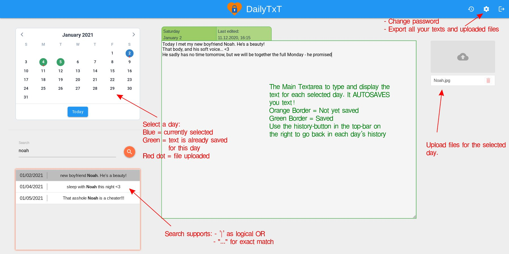

[](https://www.buymeacoffee.com/PhiTux)

# DailyTxT

> [!NOTE]
> I started to rewrite DailyTxT on end of November 2024. The new, **compatible** version will not be available before March 2025.
> I try to adress several new features like dark-mode, "on-this-day", viewing mode, ...
> It's written in Svelte & Bootstrap for the frontend and Python Fastapi for the backend.

DailyTxT is an encrypted Diary Web-App to write down your stories of the day and to find them again easily.
It is written in [Python Flask](https://flask.palletsprojects.com/) (Backend) and [Vue.JS](https://vuejs.org/) (Frontend) and meant to be run by **[Docker](https://hub.docker.com/r/phitux/dailytxt/)** - supports AMD64 and ARM64.

You should definitely take a quick look at [How to Use](#how-to-use) to see all the hidden features.

> New features will now be added only rarely. However, the support remains and in a few years there will most likely be a completely rewritten version (including upgrade support).

> 💬 Please simply open a new issue if you have any information, problem, new feature idea, new translation or anything else!
> I usually reply quickly and the project will have long support - especially security support - (unless marked as deprecated) as I use it regularly myself.

> ⚠️ Please note when submitting ideas: The basic text-layout will not be changed -> Only one plain text will be saved for each day, to keep things simple!

## Chapters

- [Features](#features)
- [How to Use](#how-to-use)
- [Installation](#installation)
- [Changelog](#changelog)

## Features

- **Encryption:** Everything you write is encrypted before it's written to the server's storage. Even the admin can't read your private stuff!
- **File-Upload:** You can upload arbitrary files for each day (128 MB max each). They are **stored encrypted** on the server as well.
- **Search:** Support your memory by easily scanning your notes for any keyword and rediscovering details you may have almost forgotten.
- **Multi-Language-Support:** The Web-App is currently available in **German**, **English**, **Spanish** and **Chinese (simplified)** translation. The language gets detected and selected automatically based on your browser's settings. More languages are easy to add - [iff](https://en.wikipedia.org/wiki/If_and_only_if) **you** provide me with the language-files! See `client/src/lang/translations`
- **Mobile:** Responsive design for easy use on mobile screen. Additionally: allows installation "A2HS" (Add 2 Home Screen)
- **Multi-User-Spport:** You can create multiple User Accounts. Each account uses its own encryption key - so there is no risk for a data breach.
- **Backup & Restore:** You can export all data (decrypted) for backup-reasons in a zip-file and reimport the data later by uploading the zip.
- **Templates:** Create templates, which you can reuse every day.
- If you came from [journey.cloud](https://journey.cloud), you could try [this script](https://github.com/PhiTux/DailyTxT/issues/13#issue-1327951670) to **import** your text to DailyTxT.
- 🌟 There also exists a [separate CLI program](https://github.com/PhiTux/dailytxt-decrypt-cli) to decrypt your files without a running server. Example use case: In 10 years your server is shut down but you still have your encrypted dailytxt-files and want to read them again.

## How to Use

There are two cool Shortcuts you should know:

- Move back/forth one day: <kbd>Alt</kbd> + <kbd>&#8592;</kbd> / <kbd>Alt</kbd> + <kbd>&#8594;</kbd>
- Select the search field: <kbd>Ctrl</kbd> + <kbd>F</kbd>



### Note on backup & restore:

You can only reimport/restore **all** data at once, that was exported before, it's not selective! The restored data is then the most recent data for each day and any previous data for that day was moved to the day's history.

## Installation

### Quickstart

Simply use the **docker-compose.yml** file from the repo. Adapt it to your needs and run

```bash
docker-compose up -d
```

### More detailed Installation

DailyTxT is intended to be run by Docker. There is an [official docker image](https://hub.docker.com/r/phitux/dailytxt/).

Use the **docker-compose.yml** file in this repo and adapt it. You see it here:

```yaml
services:
  dailytxt:
    image: phitux/dailytxt:latest
    container_name: dailytxt
    restart: always
    environment:
      # That's the internal container-port. You can actually use any portnumber (must match with the one at 'ports')
      - PORT=8765

      - SECRET_KEY=<openssl rand -base64 32>

      # Set it to False or remove the line completely to disallow registration of new users.
      - ALLOW_REGISTRATION=True

      # Use this if you want the json log file to be indented. Makes it easier to compare the files. Otherwise just remove this line!
      - DATA_INDENT=2

      # Set after how many days the JWT token will expire and you have to re-login. Defaults to 30 days if line is ommited.
      - JWT_EXP_DAYS=60

      # Enable/disable a feature of DailyTxT to auto-check maximal once per hour if there's a newer version of DailyTxT available. Defaults to True if line is ommited.
      - ENABLE_UPDATE_CHECK=True
    ports:
      - "127.0.0.1:<host_port>:8765"
      # perhaps you only want:
      # "<host_port>:8765"
    volumes:
      - "</save/my/dailytxt-files/here/>:/app/data/"
      # Or perhaps if using on a windows enviroment:
      # "C:/Users/example/dailytxt/:/app/data"
```

There are **four <ins>important</ins> things that you should adapt** to your needs:

- Generate a **secret_key** by running `openssl rand -base64 32` in your bash
- You probably want to allow the **registration** on the first run, generate the necessary accounts, and then restart the container with disallowed registration!
- Choose the **port** on your localhost.
- Select a **path**, where your diary-files are saved beyond the container lifetime.

Then simply run

```bash
docker compose up -d
```

---

**If you do NOT use docker-compose**, then simply run the following equivalent from bash (and see the info above to adapt it to your needs!):

```bash
docker run -p 127.0.0.1:<host_port>:8765 -e "PORT=8765" -e "SECRET_KEY=<openssl rand -base64 32>" -e "ALLOW_REGISTRATION=True" -v </save/my/dailytxt-files/here/>:/app/data --name dailytxt -d phitux/dailytxt:latest
```

#### ProxyPass

You will probably proxypass the container via Nginx or Apache2.
Here is an example apache-configuration (which of course needs to be slightly adapted):

```apache
<VirtualHost *:443>
    ServerName dailytxt.mydomain.tld

    SSLEngine On
    <MY-CERT-PATHS.........>

    Header always set Strict-Transport-Security "max-age=63072000; includeSubDomains"
    Header append X-FRAME-OPTIONS SAMEORIGIN

    ProxyPreserveHost On
    ProxyRequests off
    AllowEncodedSlashes NoDecode
    ProxyPass / http://localhost:8007/ nocanon
    ProxyPassReverse / http://localhost:8007/
</VirtualHost>
```

You can now (Version >= 1.0.4) also run DailyTxT on a subpath.

---

---

## Changelog

### 1.0.15

(2024_06_16)

```
- Fixed Subpath/Subdirectory support
```

### 1.0.14

(2024_03_29)

```
- Upgraded some packages and the docker-base-image
```

### 1.0.13

(2023_07_13)  
🎉 From this version on, there is also ARM64-support (tested on Apple M1).

```
- Bugfix: Dropdown-menus didn't work on Apple Webkit Browsers
- Added Chinese translation -> zh-Hans: Chinese (simplified) [1]
- Added Button to calendar to bookmark a day (shown in orange)
- Show amount of remaining backup-codes after logging in with one of them
- Now always showing version number in settings and on login
- Search-results get removed when search-field is emptied
- Slightly changed the dailytxt-icon
- Updated several packages
```

[1]: Thanks to [@Nyar233](https://github.com/Nyar233)

### 1.0.12

(2023_02_05)

```
- Updated spanish translation
- Updated several packages
```

### 1.0.11

(2023_02_03)

```
- Bugfix: Search and Export didn't work when a template was existing (sorry for bad testing 🙈)
```

### 1.0.10

(2022_11_02)

```
- Moved Settings to new separate settings-page
- Added Feature to create templates and to insert them with one (well, it's two) clicks
- Safety strengthened: Export only possible with password confirmation
- Minor CSS fixes
```

### 1.0.9

(2022_05_14)

```
- Added new environment variable 'ENABLE_UPDATE_CHECK' (see above)
- Added button to delete ALL data of the selected day
- Changes on the Service Worker (PWA) to get quicker client-update after the server was already updated (will unfortunately only take effekt in the next version after 1.0.9).
- Bugfix of a possible race-condition
- Bugfix: search didn't work in a specific case of an 'empty' log
- Bugfix: Internal server-errors no longer falsely show the message that a 'authentication is required'
```

### 1.0.8

(2022_02_06)\
_Actually a **big** update!_

```
- Added spanish translation [1]
- Added possibility to reimport (restore) data, that was exported before!
- Added possibility to create Backup Codes. They work like one-time passwords.
```

[1]: Thanks to [@SmartPhoneLover](https://github.com/SmartPhoneLover)

---

### 1.0.7

(2022_01_12)

```
- Added image preview for uploaded image-files [1]
- Bugfix: couldn't save text, when there was not yet any text for this day BUT already an uploaded file.
- Added automatic update-check with notification for new docker versions (this is sort of beta, let's see how well it works...)
```

[1]: Thanks to [@rhld16](https://github.com/rhld16)

---

### 1.0.6

(2021_12_12)

```
Docker image size was drastically reduced by new multi-stage build.
```

Thank you very much [@rhld16](https://github.com/rhld16)!

---

### 1.0.5

(2021_12_12)

```
Now automatically redirects (in most cases) to login-page when the Webtoken expired.
```

---

### 1.0.4

(2021_12_12)

```
Added possibility to run application on a subpath
```

Thanks to [@rhld16](https://github.com/rhld16)'s PR

---

### 1.0.3

```
Added two new environment variables:
1. DATA_INDENT [1]
2. JWT_EXP_DAYS
(see explanation above)
```

[1]: Thanks to [@bogosj](https://github.com/bogosj)'s PR

---

### 1.0.2

```
Minor CSS Updates.
Exported Zip now also includes the history texts.
```

---

### 1.0.1

```
Initial Release
```

## License

MIT, see the License-File.
